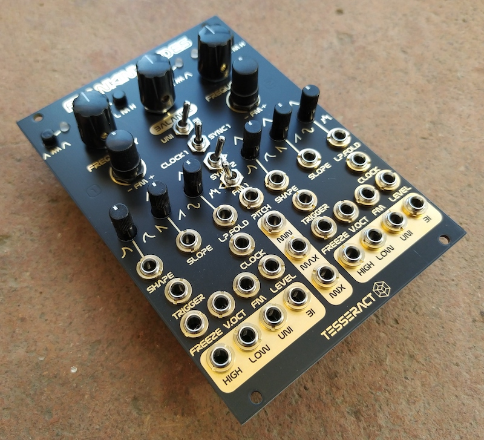

# FranKinksTides
cc-by-sa original design by Émile Gillet

Dual Tidal Modulator - Eurorack Module

FranKinksTides is a eurorack module with 2 tidal modulators based on MI Tides1 (by Émilie Gillet) and the Swirls PCB layout  (by Electric Mist)

https://mutable-instruments.net/modules/tides1/

The central part is a mixer for the 2 signals and the Max/Min circuit from MI Kinks 

https://mutable-instruments.net/modules/kinks/

It can be a dual function generator, a complex oscillator or any other combination of VCO, LFO, ENV

version history:

## first version

-First working version of this kind of 'digital Maths'

## second version (v1.2):

-Mix output is now buffered, no signal bleeding on single outs.

-Mix pot controls also the balance of the signals sent to the max/min circuit.

-Uni/bi switch now also determines the signal sent to FM1.

-Clock/sync switch has now a center OFF position, no need of plugging a dummy cable in the Clock1 when using Sheeps firmware to avoid ultra fast sound bank changes. 

other small improvements for DIY:

-Bigger font size on the pcb.

-Parts renumbered for easy DIY.

## last version (v1.4):

-Added resistors to make the Balance pot exponential, so center position has a louder output.

-PCB modified with the Thonkiccon recommendation (with no ground plane / traces under the jacks)
